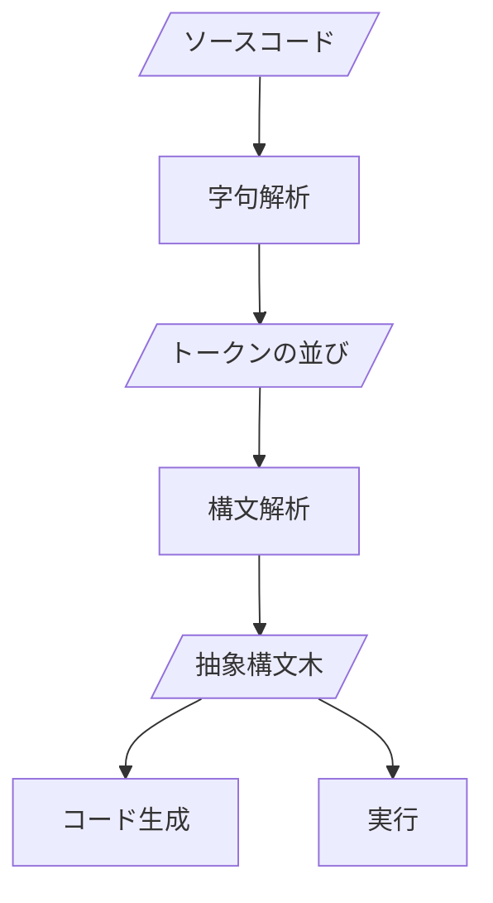

# 言語処理系内部の処理の流れ

```mermaid
flowchart TB
    A@{ shape: lean-r, label: "ソースコード" }
    L[字句解析]
    T@{ shape: lean-r, label: "トークンの並び" }
    P[構文解析]
    AST@{ shape: lean-r, label: "抽象構文木" }
    C[コード生成]
    I[実行]


    A --> L
    L --> T
    T --> P
    P --> AST
    AST --> C
    AST --> I

```

抽象構文木に変換するまではコンパイラでもインタプリタでも同じ。